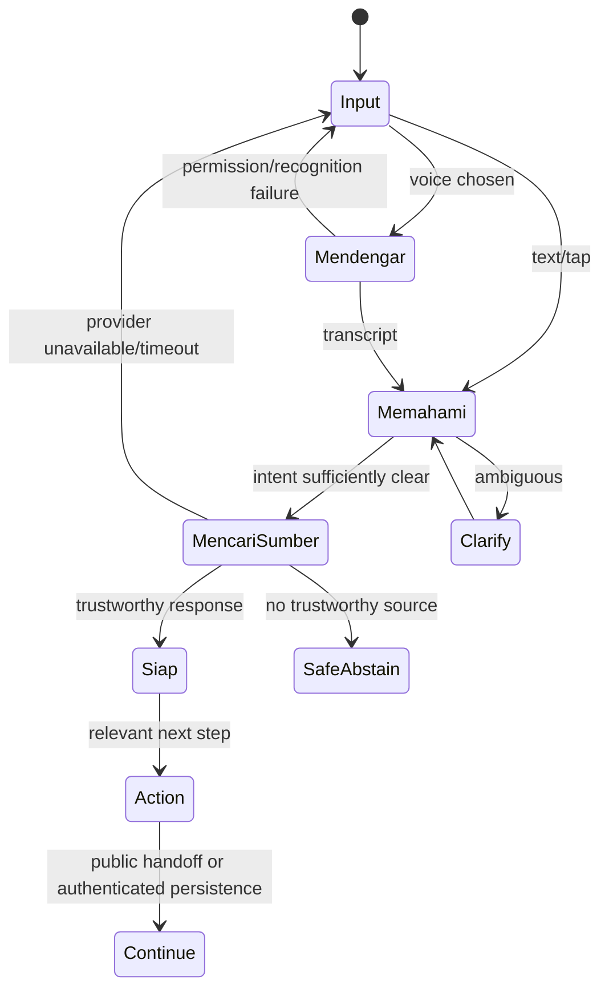

# KPP-02 ASK DUTA / Magic Moment Architecture

## Target loop

Visible conceptual states are **MENDENGAR**, **MEMAHAMI**, **MENCARI SUMBER**
and **SIAP**. Voice is first-class but optional; text and suggested intents can
complete every essential task.

## Entry and result

ASK DUTA is reachable from the primary intent, TODAY, global discovery,
contextual help and supported empty/error states. Input accepts tap suggestions,
plain text or explicit microphone activation. It does not activate voice
silently.

A successful result contains: interpreted intent; concise answer; source/status
and checked date; authority/AI boundary; relevant actions; and a continuation
path. Actions deep-link to ESSENTIAL, CONNECT, Jaga Diri or an official external
destination. Persisting a task invokes justified Auth and preserves context.

## Failure and recovery

- Voice permission denied: keep typed input focused and explain how to retry.
- Recognition failure/empty audio: offer retry and text without losing context.
- Provider unavailable or slow: show bounded deterministic/source-first result
  where supported, otherwise a clear degraded state and direct destinations.
- No trustworthy source: abstain, explain the missing evidence and offer
  official discovery; never improvise facts.
- Ambiguous request: ask one narrow clarifying question or show 2–3 intents.
- Auth required: explain the persistence/action benefit and preserve the result.
- Offline: allow local navigation/recent safe content and disclose staleness.

The current `AiChat` loading/error/retry and voice fallbacks are reusable
evidence, but hard-coded location, authenticated-only chat API behavior,
provider gaps and absent durable continuation remain implementation gaps.
