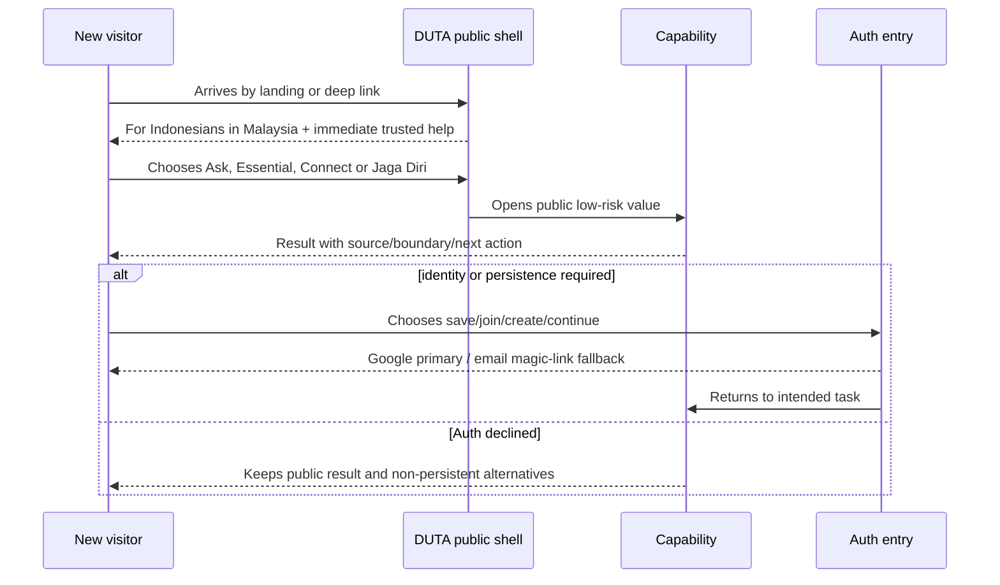

# KPP-02 User Journeys

## Public first run

Landing must state who it serves, the immediate help and independent boundary
within five seconds. Primary CTA is **Ask DUTA / Tell DUTA what you need**;
secondary CTA is **Explore essentials**. Masuk remains a quiet returning-user
action. “Daftar gratis” is not the primary acquisition CTA.

## Architecture simulations

Counts are conceptual target interactions from an already-visible shell; they
are not usability-test evidence.

| Task | Target path | Taps | Decisions | Level changes | Auth | Permission | Finding |
| --- | --- | ---: | ---: | ---: | ---: | ---: | --- |
| I need help from KJRI | Jaga Diri → situation/contact → official action | 2–3 | 1 | 1 | 0 | 0; location optional | PASS |
| I want to find work | ESSENTIAL → Kerja → result/source | 2–3 | 1 | 2 | 0; save later | 0 | PASS |
| I want to ask DUTA | ASK DUTA → type/tap/voice → result/action | 2–3 | 1 | 1 | 0 for bounded use | Voice only if chosen | PASS |
| Find Indonesian community | CONNECT → Komuniti → detail | 2–3 | 1 | 2 | 0; join later | 0 | PASS |
| I need Jaga Diri | persistent Jaga Diri → situation/action | 1–2 | 1 | 1 | 0 | Location optional | PASS |
| Continue yesterday | ME or TODAY Continue → Auth if absent → task | 2–4 | 1 | 1–2 | 0 if signed in; 1 interruption otherwise | 0 | ISSUE: continuation model not implemented |

No tutorial is required. The continuation task exposes a current implementation
gap but does not block the frozen architecture.

## Auth interruption contract

An Auth sheet/page explains the concrete benefit (“Save this job,” “Join this
community,” “Continue this task”) rather than generic sign-up copy. Cancellation
returns to the intact public state. Success returns to the allowlisted intended
route/action. Collision, provider failure or expired link never discards the
original public result.

## Recovery navigation

Each major journey provides: retry when safe; change input; continue without
permission; open verified official destination; return to parent intent; and
use text when voice/provider is unavailable. Offline states retain previously
rendered non-sensitive information and disclose freshness.
