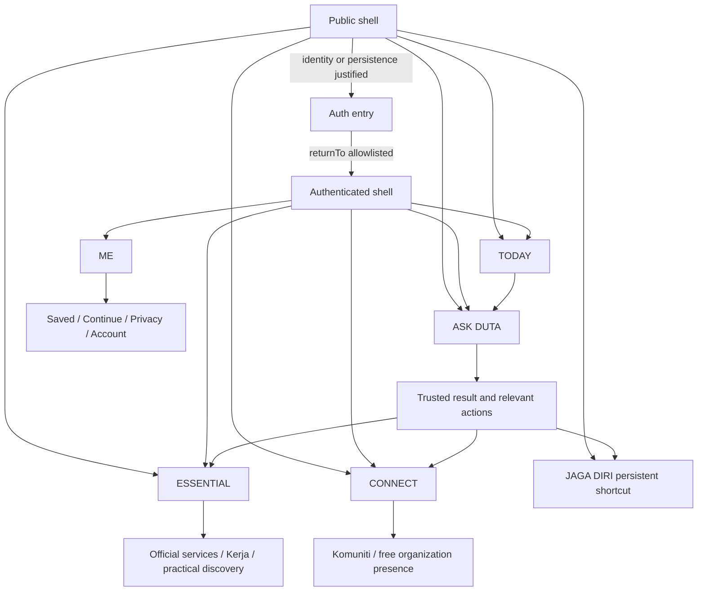

# KPP-02 UX Architecture Freeze

Date: 2026-09-18
Authority: KPP-01A FD-01–FD-05 and `KPP02_UX_ARCHITECTURE_ENTRY_CONTRACT.md`.
This is specification only; it authorizes no application implementation.

## Audit baseline

The audit covered 22 page routes, two browser-facing Auth redirect handlers,
the shared shell, desktop/sidebar/mobile navigation, landing menus, headers,
primary and secondary CTAs, Auth forms and APIs, redirects, deep links,
permission flows, loading/empty/error states and cross-module links.

Current gaps include a ten-item desktop sidebar versus the first five items on
mobile; module-led landing and Beranda grids; account-first landing CTAs;
Google without intended-task return; confirmation forced to `/profil`;
public preview profile/admin links; inert search/filter/create/save/settings
controls; hard-coded nearby content; and incomplete recovery paths.

## Frozen target architecture

### Shells

- **Public shell:** TODAY, ASK DUTA, ESSENTIAL and CONNECT are usable before
  login. ME opens a concise Auth entry, not a fake profile. Jaga Diri is always
  one action away. Public discovery and bounded DUTA do not persist identity.
- **Authenticated shell:** same mental model and route context, adding ME,
  persistence and identity-bound actions. Authentication must not land users on
  a generic dashboard when an intended task exists.
- **Admin shell:** internal, role-gated and outside consumer navigation.

## Frozen intent homes

- **TODAY:** contextual entry, trustworthy current items, bounded DUTA entry,
  nearby only with real/coarse context, and continuation after Auth.
- **ASK DUTA:** text/tap/optional voice intent, trusted answer, actions and
  continuation.
- **ESSENTIAL:** official services, Kerja, sourced practical information and
  appropriate place/service discovery.
- **CONNECT:** Komuniti and free Organisasi presence/discovery.
- **ME:** profile, saved, continue, managed organizations, privacy,
  permissions, AI/context controls, account/security and logout.
- **JAGA DIRI:** persistent safety/trust shortcut, also contextually reachable
  from TODAY, ESSENTIAL and DUTA answers.

Pasar, health, e-voting, CCTV, MyDigital ID, finance execution and uncontrolled
Citizen Report do not occupy primary navigation.

## Public-first interaction rule

Entry → understand → choose an intent → receive low-risk value → request Auth
only for identity/persistence/mutation → return to the exact safe task. Declining
Auth preserves the public result and offers non-persistent alternatives. No
generic registration wall or long form may interrupt discovery.

## Global discovery

One discovery entry accepts plain-language queries across official services,
jobs, communities, organizations, places and trusted guidance. **Search**
returns scannable indexed results and filters. **ASK DUTA** interprets,
explains and proposes next actions. Each can hand off to the other while
retaining the query; they are complementary, not duplicate destinations.

## ESSENTIAL, CONNECT and ME contracts

**ESSENTIAL** prioritizes urgent/official needs, then work and practical
discovery. Its Level-2 groups are Official help, Work, and Living in Malaysia;
Jaga Diri remains a persistent global action rather than merely another group.
Search spans the groups, contextual recommendations require explainable source
and context, and detail actions deep-link to official/external executors.

**CONNECT** presents Komuniti and free organization presence as human
connection, not product tiers. Discovery is public; join, follow, create, submit
and management require Auth plus the applicable moderation/role boundary. Paid
organization pricing and purchase paths are absent.

**ME** is the authenticated control center for real profile state, saved items,
continue, appropriate activity, managed organizations, privacy, permissions,
location controls, AI/context controls, account/security and logout. It shows
only implemented controls; privacy and deletion are not buried. Public ME
invokes Auth entry. Legacy password compatibility appears only inside account
security for eligible existing accounts.

## Trust and state slots

Every result/action architecture reserves space for origin/status, checked
date/currentness, why it appears, official external destination, AI disclosure
and user-report/moderation state where applicable. Major journeys must define
LOADING, EMPTY, ERROR, OFFLINE, PERMISSION_REQUIRED, AUTH_REQUIRED,
DEGRADED_PROVIDER and SUCCESS with a safe next action.

| Journey | Loading | Empty | Error/offline | Permission/Auth | Degraded/success |
| --- | --- | --- | --- | --- | --- |
| Public landing/navigation | Stable skeleton, no layout trap | N/A | Core intent links remain | No gate | Destination opens |
| TODAY | Per-section loading | Hide optional or honest empty | Cached/source-stamped fallback | Local to personalization/location | Sourced section shown |
| ASK DUTA | State-specific progress | Prompt/suggestions | Retry, text and direct destinations | Voice explicit; Auth only to persist | Deterministic/source-first fallback or trusted result |
| ESSENTIAL/discovery | Result skeleton | Related safe category | Keep query; official direct link | Auth only for persistence/mutation | Freshness disclosed/result opens |
| CONNECT | Card skeleton | Explain absence; explore other area | Keep filters; public path remains | Auth for join/create/manage | Public detail or action confirmation |
| ME | Account-state loading | Honest no-saved/no-continue | Recovery/support path | Auth required | Control change confirmation |
| Jaga Diri | Verified fallback immediately | Official channel route | Manual/offline directory | Location optional; no Auth for basics | Link opened, never “help received” |
| Auth/onboarding | Method-specific progress | N/A | Other approved method; retain task | 18+ boundary/JIT permissions | Resume intended task |

## Freeze decision

The primary intent model, public/Auth boundary, mobile/desktop navigation,
safety access, Auth return behavior, minimum onboarding, TODAY, ASK DUTA,
ESSENTIAL, CONNECT, ME, global discovery, trust/state system, progressive
disclosure and route strategy are frozen. No new material founder decision or
active architecture blocker was found. Exact visual styling remains open for
KPP-03.
